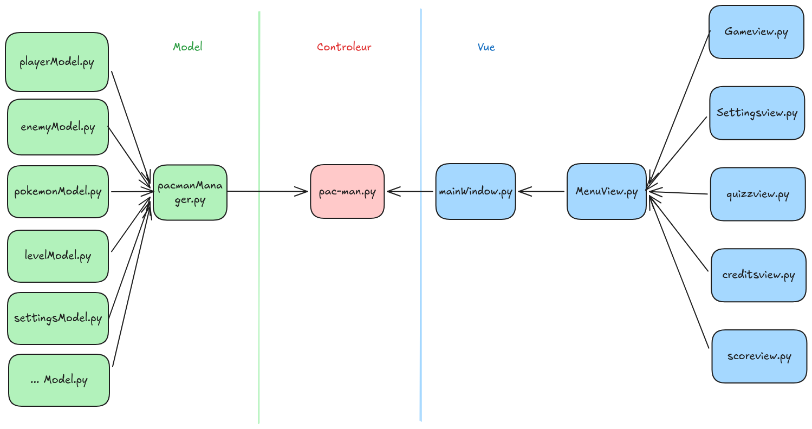

*This project has been created as part of the 42 curriculum by alebaron, rruiz*

# Pacman: Récréer un jeu vidéo légendaire à l'aide de python

## Description

**Pac-man** est un jeu vidéo créé par Tōru Iwatani en 1980. Après 46 ans d'existence, ce jeu d'arcade est toujours aussi réputé et reste un point incontournable de l'histoire des jeux vidéo. Aujourd'hui, c'est à notre tour de le développer.

Les objectifs clés de ce projet sont:

- **Création de jeu**: Apprendre à créer un jeu vidéo à l'aide des technologies modernes.
- **Réutilisation des projets d'autrui**: Utiliser le travail d'autres étudiants afin de générer notre labyrinthe.
- **Gestion de projet**: Apprendre à gérer un projet complexe en groupe.

## Installation

```bash
# Cloner le projet
git clone https://github.com/alizealebaron/pac_man.git
cd pac-man

# Installation des dépendances
uv sync
# Ou avec le makefile
make install
```

### Commandes du Makefile

```bash
# Installe les dépendances et créer un environnement
make install

# Lance le programme
make run

# Vérifie et renvoie les erreurs de normes strictes
make lint-strict

# Vérifie et renvoie les erreurs de normes
make lint

# Nettoie les fichiers créés par python
make clean

# Lance un environnement de test
make debug
```

### Exécution Basique

```bash
# Utiliser les fichiers par défaut
uv run python pac-man.py [/chemin/vers/config]
# Ou avec le makefile
make run
```

## Configuration

Cette section décrit la structure du fichier de configuration JSON utilisé par le jeu, les clés attendues, leurs contraintes et leurs valeurs par défaut.

- **Fichier de configuration** : Aucun par défaut, le jeu prendra des valeurs définit en amont.
- **Format** : JSON.

### Clés disponibles

- **`highscore_filename`** (str) : Nom du fichier de sauvegarde des scores. Par défaut "highscores.json". Doit être une chaîne non vide.
- **`level`** (list[object]) : Liste des configurations de niveaux. Chaque élément est un objet niveau avec les champs :
	- **`id`** (int) : Identifiant du niveau (>= 1).
	- **`width`** (int) : Largeur du labyrinthe (>= 2, <= 500).
	- **`height`** (int) : Hauteur du labyrinthe (>= 2, <= 500).
	Le champ `level` doit contenir au moins un niveau valide.
- **`lives`** (int) : Nombre de vies du joueur. Par défaut 3. Contraintes : >= 1, <= 1000.
- **`points_per_pacgum`** (int) : Points gagnés par pacgum normal. Par défaut 10. Contraintes : >= 1, <= 1000.
- **`points_per_super_pacgum`** (int) : Points gagnés par super pacgum. Par défaut 50. Contraintes : >= 1, <= 1000.
- **`points_per_ghost`** (int) : Points gagnés pour un fantôme mangé. Par défaut 100. Contraintes : >= 1, <= 1000.
- **`level_max_time`** (int) : Temps maximum pour compléter un niveau (en secondes). Par défaut 90. Contraintes : >= 1, <= 3600.
- **`seed`** (int ou null) : Graine pour la génération aléatoire. Par défaut 42.

### Comportement en cas de valeurs invalides

La validation est effectuée par le modèle `ConfigModel` ([src/models/configmodel.py](src/models/configmodel.py)).

Les valeurs invalides sont remplacées par leurs valeurs par défaut et un avertissement est affiché sur la sortie d'erreur.

Pour la clé `level`, les entrées non valides sont ignorées (avec avertissement). Si aucune configuration de niveau valide n'est trouvée, la valeur par défaut du modèle est utilisée.

### Exemple minimal de fichier de configuration

```json
{
	"highscore_filename": "highscores.json",
	"level": [{"id":1,"width":6,"height":6}],
	"lives": 3,
	"points_per_pacgum": 10,
	"points_per_super_pacgum": 50,
	"points_per_ghost": 200,
	"level_max_time": 90,
	"seed": 24
}
```

## Classement et score

Le système de classement (highscore) est volontairement simple, lisible et facilement modifiable : les scores sont stockés dans un fichier JSON dont le nom est défini par la clé `highscore_filename` de la configuration (par défaut `highscores.json`).

### Fonctionnement technique

Au démarrage, le jeu charge la liste des scores depuis le fichier via
	la méthode `retrieve_score_from_json()` dans
	`src/pacmanManager.py`, qui convertit chaque entrée en objet `Score`.

Lorsque le joueur choisit d'enregistrer son score (écran de victoire),
	un objet `Score` est créé et ajouté à la liste (`win_view.save_without_name`
	ou via l'interface de saisie de pseudo). La liste complète est ensuite écrite dans le fichier JSON par `update_json_score()`.

L'affichage du classement (dans la vue de `victoire`) trie la liste par
	`score` décroissant et affiche les 9 meilleurs résultats. L'affichage est aussi disponible dans la vue `menu` avec les trois meilleurs scores et la vue `classement` qui répresente les trente meilleurs scores.

### Format et contraintes des entrées

- Chaque score est un objet avec les champs :
	- `name` (str) : nom du joueur — validé par `Score` (longueur 1–10),
		et nettoyé côté vue (caractères non autorisés supprimés).
	- `score` (int) : score numérique (>= 0).
	- `pokemon` (str) : nom du pokémon associé (chaîne non vide).


### Exemple d'entrée de score

```json
[
	{"name": "Alizéa", "score": 1, "pokemon": "Ducklett"},
	{"name": "Rémy", "score": 12, "pokemon": "Mawile"}
]
```

## Génération du labyrinthe

Le projet intègre un générateur de labyrinthe provenant d'un projet a_maze_ing provenant d'un autre élève (`src/mazegenerator/mazegenerator.py`). Étant donné que cette fonctionnalité n'était pas disponible, nous avons utiliser le package a_maze_ing donné par défaut et créer par 42 central. Ce package produit une grille de cellules (matrice d'entiers codant les murs) et calcule également un chemin le plus court entre l'entrée et la sortie, ce qui facilite le positionnement des éléments du niveau et la logique de déplacement.

### Fonctionnement et paramètres

- `MazeGenerator` est instancié avec : `size=(width, height)`, `perfect` (bool), `entry_cell`, `exit_cell`, et `seed`. Si `seed > 0`, la génération est déterministe via `random.seed(seed)`, sinon une graine aléatoire est utilisée.

- Après initialisation, `generate()` construit la matrice, ajoute un motif central "42" si la taille le permet, génère les murs par exploration récursive et calcule le `shortest_path`.

### Intégration avec les niveaux

Dans `src/models/levelModel.py`, chaque `Level` crée son `MazeGenerator` avec `MazeGenerator((width, height), seed=(num_level + seed))`. La graine fournie combine le numéro du niveau et la graine globale (depuis la configuration), permettant d'obtenir des labyrinthes reproductibles et variant par niveau.

## Implémentation

Afin de proposer un projet complet sans pour autant tout développer nous même, nous nous sommes aidés de divers packages python qui nous ont permis de simplifier notre travail :

- **`arcade`** : bibliothèque principale de rendu 2D et d'UI. Toutes les vues (`game_view`, `menu_view`, `scoreboard_view`, etc.), la gestion des entrées, la lecture audio et l'affichage des sprites s'appuient sur `arcade` et `arcade.gui`.

- **`pydantic`** : validation et sérialisation des modèles de données
	(`ConfigModel`, `Score`, `PokemonModel`, `EnemyDataModel`, ... ). Permet de garantir des contraintes (types, bornes, longueurs) lors du chargement depuis JSON.

- **`argparse`** (stdlib) : parsing des arguments en ligne de commande (notamment pour passer un fichier de configuration personnalisé).

- **`Pillow (PIL)`** : utilisé pour certaines manipulations d'images dans `src/view/maze_renderer.py` (préparation/combinaison de textures).

- **`pyinstaller`** : outil de packaging (création d'exécutables standalone pour distribuer le jeu sans environnement Python installé).

- **`flake8`** et **`mypy`** :  aident à maintenir la qualité de la norme code mais ne sont pasrequis pour exécuter le jeu. Ils sont obligatoire pour la validation de notre projet.


## Architecture générale du projet

Le projet suit un modèle d'architecture MVC (Modèle — Vue — Contrôleur) simple et modulaire. Ci‑dessous un aperçu des modules principaux et de leurs relations :

- **Modèle (`src/models`)** : contient les classes de données et la logique
	métier pure :
	- `ConfigModel`, `LevelConfig` : validation et représentation de la configuration du jeu.
	- `Score` : représentation d'une entrée de classement.
	- `PlayerModel`, `Level`, `EnemyModel`, `PokemonModel`, etc. : états et règles liées aux entités du jeu.

- **Vue (`src/view`)** : toutes les interfaces graphiques et la logique de
	rendu :
	- `main_window.py`, `menu_view.py`, `game_view.py`, `scoreboard_view.py`, `save_score/*` et autres vues. Elles consomment les modèles et invoquent des actions via le contrôleur/manager.
	- `maze_renderer.py` gère le rendu visuel du labyrinthe à partir des données du générateur.

- **Contrôleur / Manager (`src/pacmanManager.py`, `src/managers/*`)** :
	orchestre la logique du jeu, met à jour les modèles et déclenche les
	changements de vues :
	- `PacmanManager` charge la configuration, crée les niveaux, le joueur, gère le scoreboard et instancie les managers (ennemis, collectibles, etc.).
	- Les managers spécifiques (`enemy_manager.py`, `collectible_manager.py`) gèrent la logique locale (IA, collisions, spawn).

- **Génération / utilitaires (`src/mazegenerator`, `src/parsing`)** :
	- `MazeGenerator` produit les labyrinthes utilisés par `Level`.
	- `parsing/config_loader.py` et `parsing/arg_parser.py` gèrent le chargement et la validation des configurations.

### Logique de démarrage

- Le jeu démarre, `PacmanManager` charge la `ConfigModel` via `ConfigLoader`.

- `PacmanManager` crée des `Level` (qui construisent des `MazeGenerator`) et instancie les `PlayerModel` et managers.

- Les vues interrogent `PacmanManager` pour obtenir l'état courant et affichent les modèles. Les actions utilisateur sont transmises au manager qui met à jour les modèles et, si besoin, change de vue.

### Illustration UML (modèle MVC)



## Gestion de projet

Afin de facilité la prise en main de ce projet qui comporttait de nombreuses tâches et fonctionnalité, nous avons mis en place un backlog. Un backlog est une liste qui priorise les fonctionnalités à améliorer et à développer en ce qui concerne un produit ou un service informatique (application mobile, logiciel, etc.). Nous avons ainsi listé la liste des fonctionnalités à implémenté et fractionné chacune d'entre elles en plusieurs tâches. Cela nous a permis d'avoir une bonne vision d'ensemble du projet. Nous avons aussi fait une liste des améliorations et bugs que nous trouvions pour améliorer notre projet au long du développement de celui-ci.

### Documents de gestion de projet

Vous pourrez retrouvez tous les documents qui ont permis d'organiser notre travail dans le dossier `project_management/`. Cela comprend les fichiers suivants :

```
project_management/
├── backlog/
    └── backlof_Pacman.xlsx		# Fichier excel contenant notre backlog avant la fin du projet      
├── sketch/
    ├── gameover_sketch.webp	# Croquis intial de la vue gameover	
    ├── mainmenu_sketch.webp	# Croquis intial de la vue menu
    └── win_sketch.webp			# Croquis intial de la vue de victoire
└── uml/
    ├── light_UML.png			# Diagramme UML simplifié de notre projet
    └── logique_findejeu.webp	# Diagramme de fonctionnement de la fin de jeu
```

### Répartition des rôles au global

**Alebaron** :
- Implémentation de l'interface utilisateur (UI)
- Implémentation du système de score
- Gestion des paramètères et cheats
- Écriture des questions du quizz
- Vérification de la docstring
- Écriture du README

**Rruiz** :
- Récupération de la config
- Génération du labyrinthe
- Déplacements du joueurs
- Déplacements des ennemies
- Correction des bugs
- Mise à la norme flake8 et mypy


## Ressources

### Documentation du jeu Pacman

- [Pac-man - Wikipédia](https://fr.wikipedia.org/wiki/Pac-Man)
- [Free pacman (jeu)](https://freepacman.org/)
- [IA des fantômes de Pac-Man visualisée](https://www.reddit.com/r/interestingasfuck/comments/cdph0r/pacman_ghost_ai_visualized/?tl=fr)

### Documentation de librairie python

- [The Python Arcade Library](https://api.arcade.academy/en/3.3.3/index.html)
- [Mypy documentation](https://mypy.readthedocs.io/en/stable/)
- [Pydantic documentation](https://pydantic.dev/docs/validation/latest/get-started/)
- [Pyinstaller Manual](https://pyinstaller.org/en/stable/)
- [Python argparse Module](https://www.w3schools.com/python/ref_module_argparse.asp)
- [Python assert Keyword](https://www.w3schools.com/python/ref_keyword_assert.asp)

### Assets / Sprite de Pokémon

- [Pokémon donjon mystère sprite](https://sprites.pmdcollab.org/)
- [Pokémon donjon mystère assets](https://www.spriters-resource.com/nintendo_switch/pokemonmysterydungeonrescueteamdx/)
- [Pokémon donjon mystère musique](https://youtu.be/w7TP5d5mUMw?si=hrDAKu1_mXS0yPxW)

### Utilisation de l'IA

- Aide au débuggage du code
- Aide à la compréhension d'éléments d'arcade
- Vulgarisation de calculs d'affichage
- Reformulation de phrases et traduction en anglais (README)
- Génération d'une partie de la docstring
- Correction d'erreur mypy

### Crédits

- **Animations des pokémons & Icones**: CHUNSOFT, Emmuffin, G~, FrivolousAqua, baronessfaron, chime, anomalocaris, Uni, Emboarger, Angels-Snack, Morei, ShyStarryRain, Ichor, Frostdrop1, Caitemis, JFain, NickOnimura, NeroIntruder

- **Musique**: Keisuke Ito, compositeur pour `Pokémon donjon mystère: Équipe de secours DX`

- **Fond d'écran et assets**: Nintendo, The Pokémon Compagny, Game Freak, CHUNSOFT.

### Disclaimer

Ce jeu est un fangame crée dans le cadre d'un projet scolaire. Pokémon et Pokémon donjon mystère appartiennent à Nintendo, Game Freak, Creatures et The Pokemon Compagny. Merci de supporter les oeuvres officielles.

---

**Dernière modification**: 13 juin 2026\
**Contact :** alebaron@student.42lehavre.fr / rruiz@student.42lehavre.fr